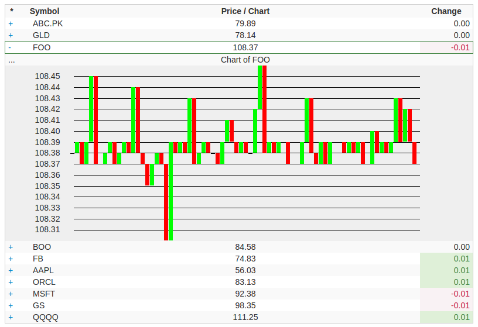

#  Introduction

A demo of react.js displaying a simulated stock ticker page.

#  Note

This uses react v0.12.2 which is quite old now.  Take this into consideration before building upon this project.

# Setup

You should be able to just point your web server to the root of this project and it will run.  Require PHP for the server part.

You may need to open up permissions on the "_stocks.json" file which stores temporary data.
